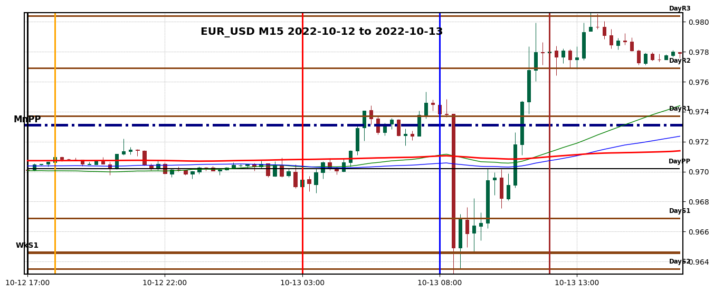

# bFin

A collection of my OHLC timeseries analysis scripts put into one package.

I've been interested in studying timeseries data for stocks and currency pairs for a long time, and had built up a giant directory of random scripts and jupyter notebooks. This project is my first step of combining everything into a more organized package.

The files in __src/bfin/oanda/api__ come from Oandas sample code: 
*  https://github.com/oanda/v20-python-samples/tree/master/src/common

# Data sources

This package was designed to chart and analyze Forex currency pairs using Oanda as a data source. 

A free Oanda account and Oanda V20 API key can be created here:

* https://www.oanda.com/us-en/trading/


When bFin is run for the first time, it will ask for your Oanda key.

Data can also be downloaded for instruments from:

* Yahoo Finance (https://finance.yahoo.com/)
* QUANDL free datasets (https://data.nasdaq.com/search?filters=%5B%22Free%22%5D) 


# Usage

```
bfin --help
Usage: bfin [OPTIONS] COMMAND [ARGS]...

  A financial charting and analysis package.

Options:
  --help  Show this message and exit.

Commands:
  analysis  Analyze an instrument and print a report
  backtest  Backtest a strategy against market data
  chart     Create chart images for an instrument
  download  Download data and display to screen, or save to file
  optimize  Optimize a strategy against market data
```

## Charting

```
[user@host ~]$ bfin chart EUR_USD M15 2022-10-01 --titles --pivot-all --sessions-all --output outputdir
Downloading from Oanda...   2022-09-28 to 2022-11-11
using sessions all
Splitting into sessions...
Generating charts...
Writing images to outputdir...
Done.
```

Output is an HTML file with a table of images, one for each trading day. Sample image:



## Downloading

```
[user@host ~]$ bfin download EUR_USD D 2022-11-01
Downloading from Oanda...   2022-11-01 to 2022-11-11
| Date                      | complete   |   Volume |    Open |    High |     Low |   Close |
|:--------------------------|:-----------|---------:|--------:|--------:|--------:|--------:|
| 2022-10-31 17:00:00-04:00 | True       |   117315 | 0.98812 | 0.9954  | 0.9853  | 0.98742 |
| 2022-11-01 17:00:00-04:00 | True       |   139126 | 0.98836 | 0.9976  | 0.9813  | 0.98156 |
| 2022-11-02 17:00:00-04:00 | True       |   129115 | 0.98188 | 0.98398 | 0.97302 | 0.975   |
| 2022-11-03 17:00:00-04:00 | True       |   151902 | 0.97531 | 0.99666 | 0.97426 | 0.99589 |
| 2022-11-06 17:00:00-05:00 | True       |   127342 | 0.99086 | 1.00345 | 0.99048 | 1.0021  |
| 2022-11-07 17:00:00-05:00 | True       |   104468 | 1.00181 | 1.00965 | 0.99716 | 1.00732 |
| 2022-11-08 17:00:00-05:00 | True       |   151700 | 1.00769 | 1.00884 | 0.9993  | 1.00117 |
| 2022-11-09 17:00:00-05:00 | True       |   174853 | 1.00118 | 1.0222  | 0.99354 | 1.02076 |
| 2022-11-10 17:00:00-05:00 | False      |   156906 | 1.02063 | 1.03401 | 1.01632 | 1.0333  |

[user@host ~]$ bfin download EUR_USD D 2022-11-01 --filename eur_usd_2022-11-01.csv
Loading from cache...   2022-11-01 to 2022-11-11
Writing to "eur_usd_2022-11-01.csv"
```

## Analysis

```
[user@host ~]$ bfin analysis EUR_USD D 2022-01-01 --extrema 20 --ranges
Downloading from Oanda...   2021-12-07 to 2022-11-11
================================================================================
= Bar Ranges

  Time    Range    Rank
------  -------  ------
     0   0.0088       5
     1   0.0097       4
     2   0.0103       2
     3   0.0115       1
     4   0.0098       3


================================================================================
= Extrema 20

Date                         Value     Pips    Percent    Bars
-------------------------  -------  -------  ---------  ------
2021-12-14 17:00:00-05:00   1.1222   0.0000    0.0000%       0
2022-02-09 17:00:00-05:00   1.1495   0.0273    2.4345%      41
2022-03-06 17:00:00-05:00   1.0806  -0.0689   -5.9939%      17
2022-03-30 17:00:00-04:00   1.1185   0.0379    3.5064%      18
2022-05-12 17:00:00-04:00   1.0349  -0.0836   -7.4717%      31
2022-05-29 17:00:00-04:00   1.0787   0.0438    4.2303%      11
2022-07-13 17:00:00-04:00   0.9952  -0.0835   -7.7389%      33
2022-08-09 17:00:00-04:00   1.0369   0.0417    4.1860%      19
2022-09-27 17:00:00-04:00   0.9536  -0.0833   -8.0318%      35
2022-11-10 17:00:00-05:00   1.0340   0.0804    8.4323%      32
```

## Optimizer

```
[user@host ~]$ bfin optimize EUR_USD H1 2022-10-01
Optimizing EUR_USD H1 2022-10-01 00:00:00-04:00 2022-11-11 12:44:21.791964-05:00

Strategies
   1. Moving Average Cross

Enter Strategy Number: 1

Required parameters: generator_short, generator_long

Generator format is "<start>, <stop>, <step>"
Enter short period generator: 20,160,20
Enter long period generator: 60,240,20

Download start: 2022-09-20 14:00:00-04:00, Chart start: 2022-10-01 00:00:00-04:00
Downloading from Oanda...   2022-09-20 to 2022-11-11

Optimizer results for: StrategyMACross
Initial equity: 10000
Generators: {'gen_short': (20, 160, 20), 'gen_long': (60, 240, 20)}

| settings   |   trades |   win |   profit_total |   profit_mean |   winners_mean |   losers_mean |   equity |
|:-----------|---------:|------:|---------------:|--------------:|---------------:|--------------:|---------:|
| (40, 100)  |        5 |     4 |        0.01896 |    0.003792   |     0.0054225  |   -0.00273    | 15336.7  |
| (80, 120)  |        6 |     4 |        0.01625 |    0.00270833 |     0.0066225  |   -0.00512    | 13489.3  |
| (40, 60)   |       12 |     6 |        0.02223 |    0.0018525  |     0.00947    |   -0.005765   | 12739.2  |
| (20, 100)  |        5 |     2 |        0.00333 |    0.000666   |     0.006905   |   -0.00349333 | 10230.4  |
| (60, 160)  |        5 |     2 |        0.00391 |    0.000782   |     0.00818    |   -0.00415    | 10225.2  |
| (80, 140)  |        5 |     2 |        0.00265 |    0.00053    |     0.008235   |   -0.00460667 | 10039    |
| (40, 180)  |        3 |     1 |        0.00436 |    0.00145333 |     0.01809    |   -0.006865   |  9945.52 |
| (20, 120)  |        5 |     2 |       -0.00332 |   -0.000664   |     0.00627    |   -0.00528667 |  8474.16 |
| (60, 80)   |        6 |     3 |       -0.00435 |   -0.000725   |     0.00697333 |   -0.00842333 |  7687.74 |
| (80, 160)  |        3 |     1 |       -0.01016 |   -0.00338667 |     0.0095     |   -0.00983    |  6847.91 |
| (40, 80)   |        6 |     3 |       -0.01088 |   -0.00181333 |     0.00415333 |   -0.00778    |  6791.44 |
| (60, 220)  |        3 |     1 |       -0.01441 |   -0.00480333 |     0.0043     |   -0.009355   |  6417.12 |
| (20, 200)  |        3 |     1 |       -0.01358 |   -0.00452667 |     0.00439    |   -0.008985   |  6414.05 |
| (20, 220)  |        5 |     1 |       -0.01603 |   -0.003206   |     0.00607    |   -0.005525   |  6280.28 |
| (40, 120)  |        5 |     1 |       -0.01611 |   -0.003222   |     0.00442    |   -0.0051325  |  6221.32 |
```

## Backtester

```
[user@host ~]$ bfin backtest EUR_USD H1 2022-10-01
Backtesting EUR_USD H1 2022-10-01 00:00:00-04:00 2022-11-11 12:45:29.490378-05:00

Strategies
   1. Moving Average Cross

Enter Strategy Number: 1

Required parameters: period_short, period_long

Enter period_short: 80
Enter period_long: 120


Download start: 2022-09-20 14:00:00-04:00, Chart start: 2022-10-01 00:00:00-04:00
Loading from cache...   2022-09-20 to 2022-11-11
Backtesting...


Initial Equity: 10000

date_opened                date_closed                  dir  signal      bars    opened    closed    profit    favor    adver    equity
-------------------------  -------------------------  -----  --------  ------  --------  --------  --------  -------  -------  --------
2022-10-07 16:00:00-04:00  2022-10-09 22:00:00-04:00      1  Signal         7    0.9742    0.9738   -0.0004   0.0011   0.0018   9892.22
2022-10-09 23:00:00-04:00  2022-10-14 06:00:00-04:00     -1  Signal       104    0.9738    0.9719    0.0019   0.0107   0.0071  10379.82
2022-10-14 07:00:00-04:00  2022-10-21 16:00:00-04:00      1  Signal       130    0.9719    0.9886    0.0167   0.0157   0.0014  14844.11
2022-10-23 17:00:00-04:00  2022-10-25 02:00:00-04:00     -1  Signal        34    0.9886    0.9856    0.0030   0.0079   0.0014  15955.24
2022-10-25 03:00:00-04:00  2022-10-31 23:00:00-04:00      1  Signal       117    0.9856    0.9905    0.0049   0.0237   0.0008  17934.19
2022-11-01 00:00:00-04:00  2022-11-08 03:00:00-05:00     -1  Signal       124    0.9905    1.0004   -0.0098   0.0175   0.0129  13489.25

Total pips profit: 0.0163

Trades: 6, winners 4, losers 2
```

